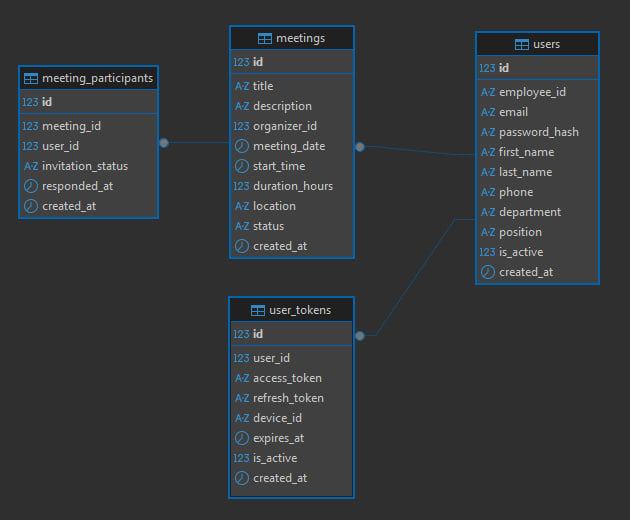

#Timexample

--ЗАДАНИЕ 2 
# User Stories - US

US1 Регистрация нового сотрудника:
Как новый сотрудник компании, я хочу зарегистрироваться в системе, указав свой корпоративный email и основные данные, чтобы получить персональный доступ к системе планирования встреч и видеть свой профиль среди коллег.

US2 Просмотр и редактирование профиля:
Как сотрудник, я хочу иметь возможность просматривать и при необходимости обновлять информацию в своем личном профиле (имя, фамилию, должность, аватар), чтобы мои данные для коллег всегда были актуальными.

US3 Создание новой встречи:
Как инициатор встречи, я хочу создать новое событие, указав тему, дату, строго часовой временной слот (например, 14:00–15:00) и выбрав из списка коллег для приглашения, чтобы согласовать и запланировать совместное обсуждение.

US4  Ответ на приглашение на встречу:
Как приглашенный сотрудник, я хочу видеть список всех полученных мной приглашений и иметь возможность одним действием (кнопкой) подтвердить свое участие или отклонить предложение, чтобы организатор и другие участники знали мой статус.

US5 Просмотр личного расписания:
Как сотрудник с насыщенным графиком, я хочу просматривать свой календарь в трех режимах (день, неделя, месяц) и видеть там все запланированные встречи, в которых я участвую, чтобы эффективно управлять своим рабочим временем и избегать накладок.
---------------------------------------------------------------------------------------------------------------------------
# Use Cases - UC 

UC1 for US1 Регистрация
Основной сценарий начинается с того, что пользователь (новый сотрудник) открывает приложение и нажимает кнопку «Зарегистрироваться». Система отображает форму с обязательными полями: корпоративный email, пароль, подтверждение пароля, имя и фамилия. После заполнения и нажатия кнопки отправки система проверяет, не зарегистрирован ли уже этот email. Если все данные валидны, система создает новую учетную запись в базе данных, автоматически выполняет вход для нового пользователя и перенаправляет его на экран главного меню. Альтернативный поток: если email уже существует, система показывает сообщение об ошибке и предлагает пользователю войти или восстановить пароль.

UC2 for US2 Управление профилем
Сценарий предполагает, что пользователь (авторизованный сотрудник) переходит в раздел «Мой профиль» из главного меню. Система отображает текущие данные профиля в режиме просмотра. Пользователь нажимает кнопку «Редактировать», после чего поля данных становятся активными для изменений. Он может отредактировать имя, фамилию, добавить ссылку на аватар или выбрать должность из выпадающего списка. После сохранения изменений система обновляет информацию в базе данных и подтверждает успешное обновление, возвращая профиль в режим просмотра. Если данные не были изменены, система просто закрывает режим редактирования.

UC3 for US3 Создание встречи:
Пользователь (cотрудник-организатор) на главном экране нажимает кнопку «Создать встречу». Система открывает форму с полями: «Тема встречи» (текстовое поле), «Дата» (виджет календаря), «Время начала» (выпадающий список с часовыми слотами, например, 9:00, 10:00, 11:00) и «Список участников» (поисковое поле с выбором из списка всех сотрудников). После заполнения всех обязательных полей и нажатия кнопки «Создать» система сохраняет встречу в базе данных, генерирует приглашения для каждого выбранного участника и отправляет им push-уведомление или внутреннее оповещение. Организатор видит подтверждение об успешном создании.

UC4 for US4 Ответ на приглашение:
Когда пользователь (приглашенный сотрудник) получает уведомление о новой встрече или открывает вкладку «Приглашения». Система показывает список предстоящих встреч, где напротив каждой указаны тема, дата, время и статус («ожидает ответа»). Для выбранной встречи пользователь видит две кнопки: «Принять» и «Отклонить». При нажатии на одну из них система отправляет на сервер его решение, обновляет статус приглашения в базе данных и уведомляет организатора встречи об изменении. В интерфейсе пользователя эта встреча перемещается в соответствующий раздел.

UC5 for US5 просмотр расписания:
Пользователь (потрудник) переходит на вкладку «Календарь». По умолчанию система отображает расписание на сегодняшний день в виде списка, где занятые слоты отмечены (например, блок с темой встречи с 14:00 до 15:00). Пользователь может переключить вид на «Неделя» (таблица с днями недели и часами) или «Месяц» (классический календарный вид, где дни с встречами помечены точкой). При тапе на любое событие в любом из видов система показывает детальную информацию о встречи: тему, список участников, статус их ответов. Это позволяет сотруднику быстро оценить свою загруженность.
---------------------------------------------------------------------------------------------------------------------------
# Задачи для Backend-разработчика

1. Для регистрации новых сотрудников
Нужно создать в базе данных таблицу для хранения пользователей, где будут храниться почта, пароль, имя и фамилия. Затем сделать специальный адрес на сервере, куда можно отправить эти данные. Сервер проверит, нет ли уже в базе человека с такой почтой, и если её нет — сохранит нового пользователя и сразу разрешит ему доступ в систему.

2. Для входа зарегистрированных сотрудников
Нужно создать другой адрес на сервере, куда пользователь будет отправлять свою почту и пароль. Сервер проверит, есть ли такой человек в базе и правильный ли пароль. Если всё совпадает — сервер разрешит доступ к личному кабинету.

3. Для хранения данных о встречах
Нужно создать в коде структуры для встреч и приглашений. Встреча будет содержать информацию о создателе, теме, дате и времени (только по целым часам). Приглашение — это связь между встречей и приглашённым человеком, а также информация, согласился ли он. Эти структуры нужно превратить в таблицы в базе данных.

4. Для создания новых встреч
Когда пользователь создаёт встречу, он отправляет на сервер тему, дату, время и список приглашённых. Сервер должен сохранить эту встречу в базу и для каждого приглашённого человека создать запись-приглашение со статусом «ожидает ответа».

5. Для просмотра и ответа на приглашения
Нужно сделать так, чтобы пользователь мог получить список всех встреч, куда его пригласили и на которые он ещё не ответил. И отдельно — возможность отправить свой ответ (согласен или нет). Сервер должен обновить статус приглашения в базе данных.

6. Для изменения данных профиля
Пользователь должен иметь возможность менять свои данные (имя, фамилию и т.д.). Нужно сделать адрес для показа текущих данных и адрес для сохранения обновлённой информации. Важно, чтобы каждый человек мог редактировать только свой собственный профиль.
---------------------------------------------------------------------------------------------------------------------------

# Техническое задание на разработку программного продукта для планирования встреч

## 1. Общие описание
Необходимо разработать программный продукт для планирования встреч сотрудников внутри компании. Система состоит из клиентского мобильного приложения и серверной части.

## 2. Клиентская часть (Android-приложение)
Клиентом является **Android-приложение**, которое должно быть реализовано на **Kotlin** или **Java** с использованием **адаптивной верстки**.

Приложение должно предоставлять интуитивно понятный интерфейс, в котором реализован следующий функционал:

*   **Регистрация и авторизация** сотрудника.
*   **Настройка личного профиля**.
*   **Создание встречи** с возможностью приглашения других сотрудников. Приглашенные сотрудники должны иметь возможность дать бинарный ответ (**принял** / **не принял**).
*   **Просмотр списка активных приглашений** на встречи с возможностью дать ответ о возможности посещения.
*   **Просмотр собственного расписания встреч** в разрезе дня, недели и месяца.

**Важное условие:** временные слоты для встреч разбиты строго по часам. Например, можно создать встречу на 9:00–10:00, но создание встречи на 9:10, 9:05 и т.д. — невозможно.

## 3. Серверная часть
Сервер представляет собой **микросервис на Spring Boot**, работающий с СУБД **PostgreSQL** или **H2**.

Серверное приложение должно:
*   Предоставлять API, необходимый для полноценной работы мобильного приложения.
*   Осуществлять все основные операции с данными в базе через **Spring Data JPA**.
*   Использовать **Liquibase** для создания схемы базы данных и ее предзаполнения.
